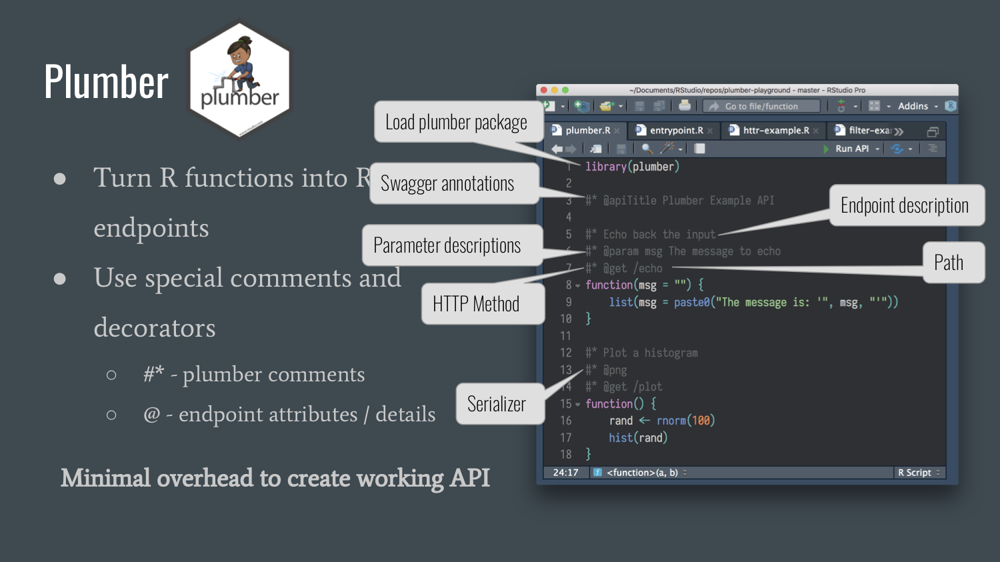

# Building robust APIs in R with [plumber](https://www.rplumber.io)

Talk given at the Salt Lake City R Users Group

August 9, 2018

---

This repository contains:

- [All code used for mtcars data](R)

